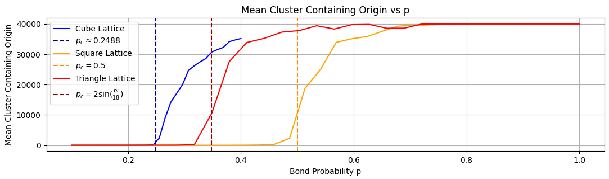

# Bond Percolation

Bond percolation is a sub-area of graph theory and probability theory that studies the properties of random subgraphs that emerge when edges in specific graphs are
independently kept with some probability p. For specific graphs, there are certain values of p at which infinitely connected clusters suddenly appear. This is called 
a graph's _critical probability_ (denoted $p_c$).

While proving exact values for $p_c$ can be hard, we can estimate this value through computer simulations. The code in this repository can be used to estimate these values for 
certain graphs, and provide interactive simulations for people to better understand percolation.

| Lattice  | Known $p_c$ | Simulated $p_c$
| ------------- | :-------------: | :-------------: |
| Triangle | $2\sin(\frac{\pi}{18})$ | 0.3287 |
| Square ($L^2$)  | $\frac{1}{2}$ | 0.4853 |
| Cube ($L^3$) | $\approx 0.2488$  | 0.2549 |
| Complete Graph ($K_{50}$)  | $\frac{1}{50}$ | 0.0274 |
| Complete Graph ($K_{100}$)  | $\frac{1}{100}$ | 0.0127 |
| Complete Graph ($K_{150}$)  | $\frac{1}{150}$ | 0.0076 |

You can read more about this topic [in the final report this code was created for](Math_Final_Report.pdf).

## Features
- Simulates Bond Percolation: Runs simulations on finite 2D square, triangle, 3D cube, and complete graphs

- Interactive Visualization: Includes interactive simulations to demonstrate the phase transition phenomenon where large components suddenly appear

- Component Size Analysis: Records and averages the size of the connected component containing the origin as edge probability p varies

## How to Run

- **Interactive**: Contains the code for interactive simulations such as
  -  `InteractiveGraph.py` which simulates bond percolation on the square, triangle, and cube lattices, and
  -  `CompleteGraphs.py` which simulates bond percolations on a complete graph (a.k.a., the Erdős–Rényi model)

- **GenerateData**: Contains scripts to simulate bond percolation on different lattices and generate `.csv` files containing this data
- **PlotEstimates**: Contains scripts to plot calculated estimates alongside the known values of $p_c$
