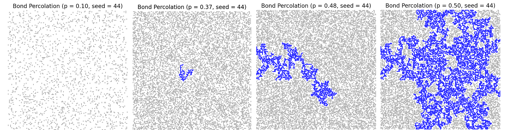

Bond percolation is a sub-area of graph theory and probability theory that studies the properties of random subgraphs that emerge when edges in specific graphs are
independently kept with some probability p. For specific graphs, there are certain values of p at which infinitely connected clusters suddenly appear. This is called 
a graph's _critical probability (denoted $p_c$).

While proving exact values for $p_c$ can be hard, we can estimate this value through computer simulations. The code in this repository can be used to estimate these values for 
certain graphs, and provide interactive simulations for people to better understand percolation.

## Features
- Simulates Bond Percolation: Runs simulations on finite 2D square, triangle, 3D cube, and complete graphs

- Interactive Visualization: Includes interactive simulations to demonstrate the phase transition phenomenon where large components suddenly appear

- Component Size Analysis: Records and averages the size of the connected component containing the origin as edge probability p varies

